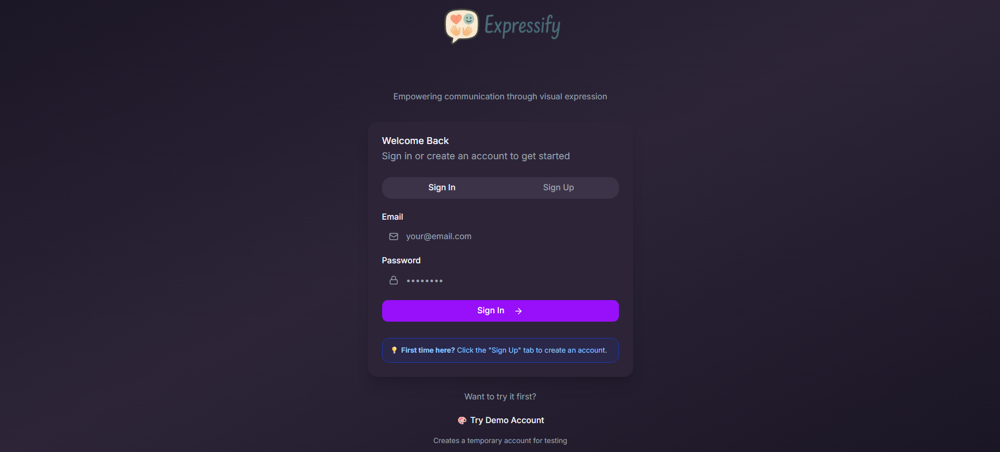
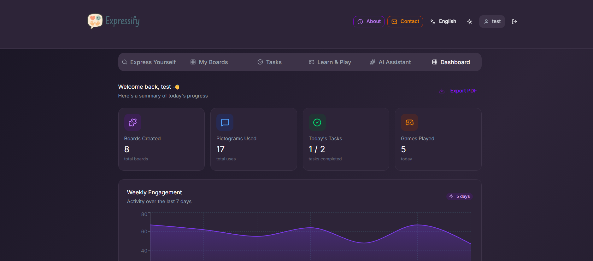
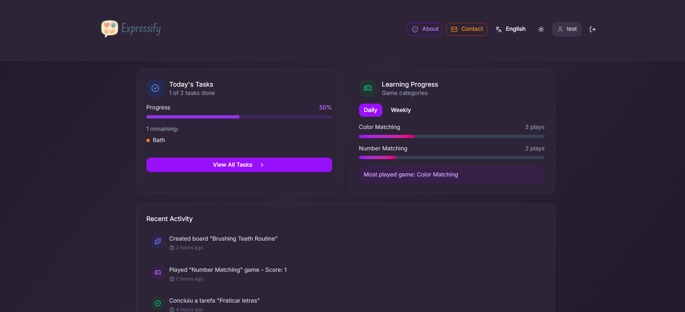
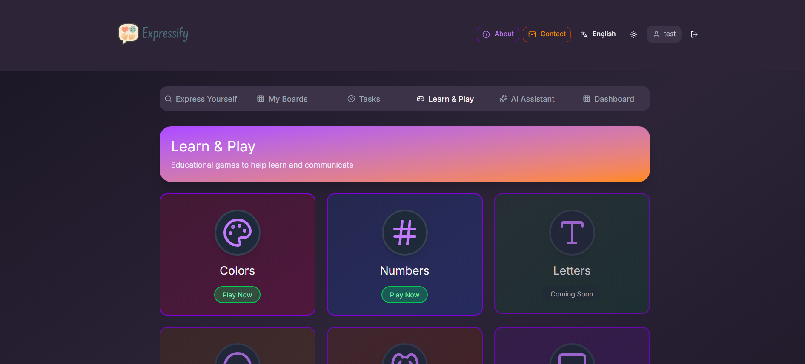
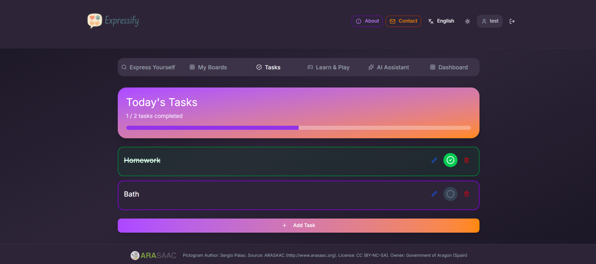
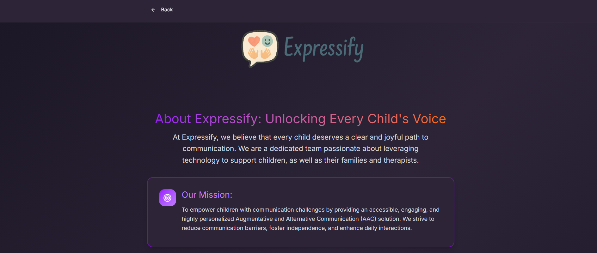
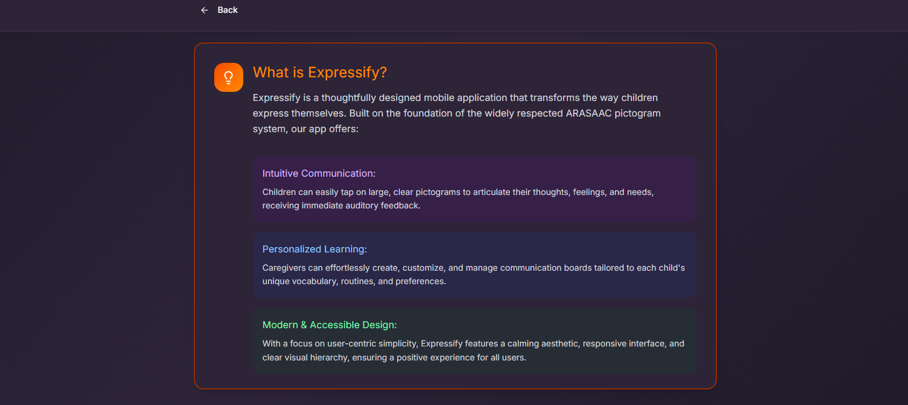
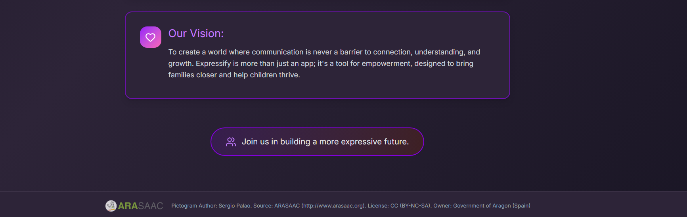

# Expressify

This is a code bundle for Expressify. The original project is available at https://www.figma.com/design/0zFOt78ggyPG9bLNLssiJO/Expressify.

## Running the code

Run `npm i` to install the dependencies.

Run `npm run dev` to start the development server.

## Screenshots

### Main Page

### Login

### AI Assistant

### Boards Page

### Boards View

### Dashboard

### Game

### Tasks

### About

